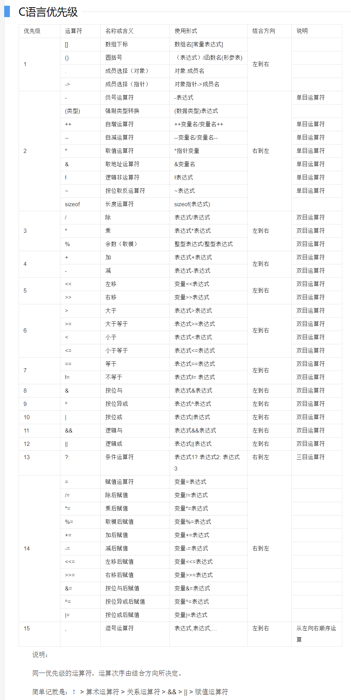

# Summary of knowledge points for ANSI C to my girl
## 基础知识
### 变量
* 变量名由字母、数字、下划线组成，首字母必须为字母或下划线
* 声明变量使用[变量类型 变量名;]，如(int number;)
* 变量使用前必须声明
* 变量使用前必须赋值，否则读出的是该变量的地址
* 在C89标准下，变量必须声明在程序最前
* 多个变量可以声明在同一行，用逗号隔开，如(int a,b;)
* 数字类型变量可以用科学计数法表示，如(12.34e5)表示12.34 x 10^5
* char类型存储的实际是字符的ASCII码，回车(10),空格(32),0(48),A(65),a(97)
* 几乎所有主流语言均使用\作为转义字符，回车('\n'),空字符('\0'),制表符('\t')
* 符号常量，使用[#define]关键字定义，如(#define PI 3.1415)

变量类型 | 用途 | 占用空间
--------|------|--------
char | 字符 | 8
int | 整数 | 32
long | 长整数 | 64
float | 浮点数 | 32
double | 双精度 | 64

### 程序结构
* 程序总是从main函数开始执行
* 一个程序只能包含一个main函数
* main函数返回值必须为int类型，返回0表示程序正常退出
* C语言以;作为行结束的标识，即一行代码可以写在多行上，多行代码也可以写在一行上
* 程序结构包括顺序结构，选择结构，循环结构
* 顺序结构即，计算机按从上至下的顺序执行每一行的代码
* 使用//表示行注释，/*  */表示块注释

### 运算符和表达式
* 算数运算符，关系运算符，赋值运算符
* 从上至下为运算符优先级


## 选择结构
* ?:表达式[①?②:③]表示当满足1的条件时返回2表示的值，否则返回3的值
### if语句
* 可以不使用大括号将代码括起来，但必须保证执行的代码只有一行
* 能正确区分if()...else if()... 和if()...if()...，2种写法
```
if(condition1)//满足条件1则执行括号里的代码
{
    ......
}
else if(condition2)//不满足条件1，但满足条件2则执行括号里的代码
{
    ......
}
else//不满足条件1和2则执行括号里的代码
{
    ......
}
if(condition3)//无论是否满不满足条件1和2，都会重新判断是否满足条件3，因为这属于2个不同的if语句
{
    ......
}
```
### switch语句
```
switch(condition)
{
    case 1://表示condition表达式的值为1的情况
        ......
    break;
    case 3://表示condition表达式的值为3和4的情况
    case 4:
        ......
    break;
    default://表示剩下的情况
        ......
    break;
}
```

## 循环结构
* 使用continue语句直接跳到下一次循环
* 使用break语句跳出循环
### for循环
* for(①;②;③)，表示循环开始时执行1里的代码，每次循环开始执行3里的代码，直到不满足2则循环结束
### while循环
* while(condition)，表示执行循环，直到不满足条件为止
* 有可能一次循环也不执行，即一开始就不满足条件
### do...while循环
* do...while(condition)，表示先执行代码，在判断是否满足条件，如果满足则开始下一次循环
* 与while循环不同，do...while循环至少会执行一次

## 函数
* type表示这个函数的返回值类型，无返回值则用void表示
* name表示这个函数的名称
* parameter表示传递给这个函数的参数
* 若返回值不为void则必须用return语句返回结果
* 返回值为void也可以在中间使用return语句，表示直接中断函数并返回
```
type name(parameter)
{
    ......
}
```
### scanf(),printf()函数
* 使用"%d"表示输入/输出整形，"%nd"表示占n位右对齐输出，%-nd表示占n位左对齐输出
* 使用"%c"表示输出/输出字符，"%s"输出字符串以空格结束
* 使用"%f","%lf","%ld"表示输入/输出浮点数，双精度浮点数，长整型变量
* 使用"%.nf"表示保留n位小数输出
### getchar(),putchar()函数
* 输入/输出当个字符
### gets(),puts()函数
* 输出/输出字符串，以'\0'结束
### math.h内置函数
* 使用sqrt()函数计算平方根
* 使用abs()函数取整形的绝对值
* 使用fabs()函数取浮点数的绝对值
* 使用pow()函数计算幂函数

## 指针

## 结构体
* 使用.操作符访问结构体的成员
* 声明结构体使用[struct 类型 名称]
* 结构体同样可以申明结构体数组
```
struct student //定义一个学生结构体
{
    char name[10]; //学生有姓名
    int height; //学生的身高
    int weight; //学生的体重
    int isGirl; //学生的性别
}; //最后不要忘记分号
```

## 常用算法
### 冒泡排序(从小到大)
```
void sort(int data[], int length)
{
    int i, j, tmp;
    for (i = 0; i < length - 1; i++)
    {
        for (j = 0; j < length - 1 - i; j++)
        {
            if (data[j] > data[j + 1])
            {
                tmp = data[j];
                data[j] = data[j + 1];
                data[j + 1] = tmp;
            }
        }
    }
}
```
### 选择排序(从小到大)
```
void sort(int data[], int length)
{
    int i, j, min, tmp;
    for (i = 0; i < length - 1; i++)
    {
        min = i;
        for (j = i + 1; j < length; j++)
            if (data[j] < data[min])
                min = j;
        tmp = data[min];
        data[min] = data[i];
        data[i] = tmp;
    }
}
```
